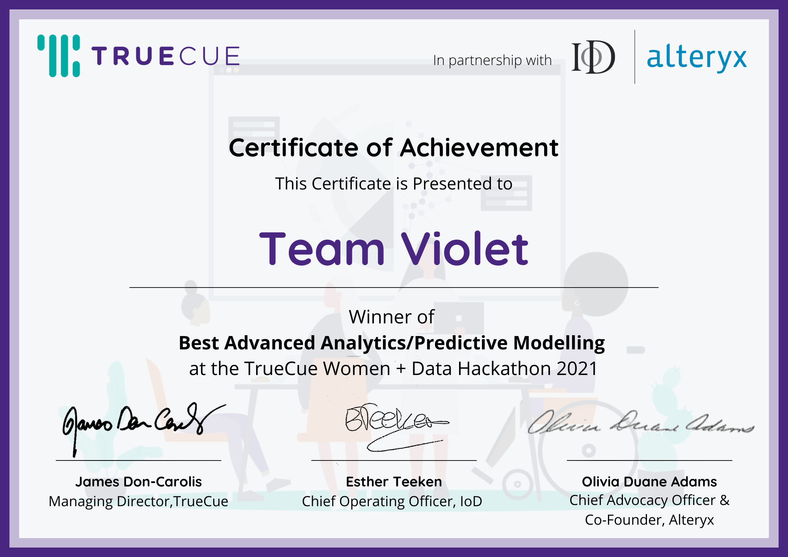

# TrueCue and Women+Data Hackathon 2021
## Team Violet Submission
Slides: [Progress Towards Reducing Global Inequality](https://www.canva.com/design/DAEwd_H5LJQ/dVuf5EhvTynBzCXIvSNhPA/view?utm_content=DAEwd_H5LJQ&utm_campaign=designshare&utm_medium=link&utm_source=sharebutton)

Video: [Finalist Presentations](https://vimeo.com/653708599)

## Introduction
TrueCue and Women+Data Hackathon is an annual women's only hackathon. The topic for 2021 was sustainability.

The initial challenge was working out how broad or narrow to make our analysis, and what were useful questions to ask of the data. We were all drawn towards the topic of inequality, so we decided to focus on United Nations Sustainable Development Goal 10 (SDG10): Reduced Inequalities. Considering how to approach this question, we decided to investigate different ways that inequality can be measured and conceptualised, with the United Nations definition being the focal point.

## The Data
The data brief provided by TrueCue can be found [here](https://github.com/ikram-data/Violet-WD-Hackathon/blob/main/Data/Data%20Brief%20(2021).pdf). This data was sourced from [World Bank Data Bank](https://databank.worldbank.org/source/world-development-indicators), [United Nations SDG Indicators Database](https://unstats.un.org/sdgs/unsdg) and [Our World in Data](https://ourworldindata.org/grapher/political-regimes)
We also used data from [V-Dem Institute](https://www.v-dem.net/data.html).

A significant challenge we faced was the lack of workable data to both meet the assumptions of FA and make it representative of SDG10 metrics. 

## Modelling
We used Factor Analysis (FA), an unsupervised machine learning technique that allowed us to: 
- Reduce the dimensionality of the data
- Identify underlying variables that might be important or interesting to analyse

## Results
We created our own index to measure inequality.

## Conclusions

